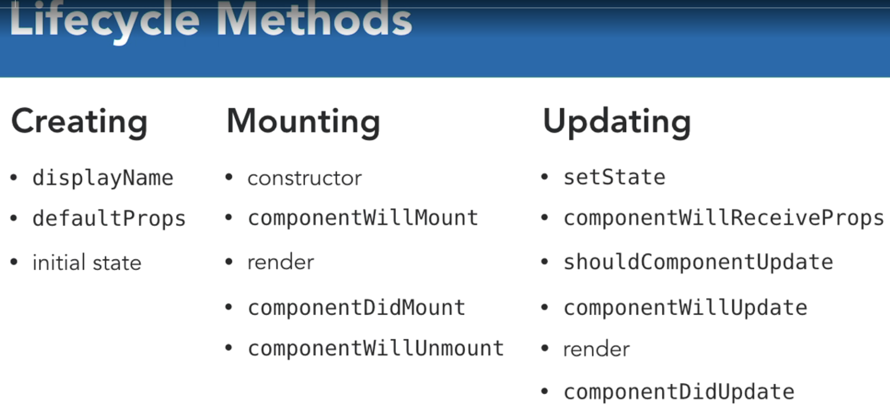
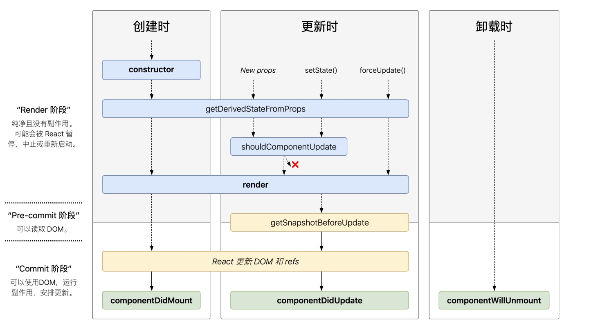

## React events
- Constructor

- componentWillMount / UNSAFE_componentWillMount
Above React 17, 将不存在componentWillMount

由于componentWillMount/ UNSAFE_componentWillMount是在render之前调用，所以就算在这个方法中调用setState也不会触发重新渲染（re-render）

同时React引入两个钩子函数来替代它们，分别是：
getDerivedStateFromProps，getSnapshotBeforeUpdate


- componentDidMount

- componentWillUnmount
Happens then hide a component.
It is the opportunity to clean up, like timer. 

- componentWillUpdate / UNSAFE_componentWillUpdate

- getDerivedStateFromProps
无论我们接收到新的属性，调用了setState还是调用了forceUpdate，这个方法都会被调用


- getSnapshotBeforeUpdate
这个方法在render之后，componentDidUpdate之前调用，有两个参数prevProps和prevState，表示之前的属性和之前的state，这个函数有一个返回值，会作为第三个参数传给componentDidUpdate，如果你不想要返回值，请返回null，不写的话控制台会有警告

## Load
```
Parent Counstructor
Parent componentWillMount
  Child Counstructor
  Child componentWillMount
  Child componentDidMount
Parent componentDidMount
```


## Set state
```
Parent setState
Parent shouldComponentUpdste
Parent componentWillUpdate
  Child componentWillReceiveProps
  Child shouldComponent
  Child componentWillUpdate
  Child componentDidUpdate
Parent componentDidUpdate
```

## Hide Child
```
Parent setState
Parent shouldComponentUpdste
Parent componentWillUpdate
  Child componentWillUnmount
Parent componentDidUpdate
```